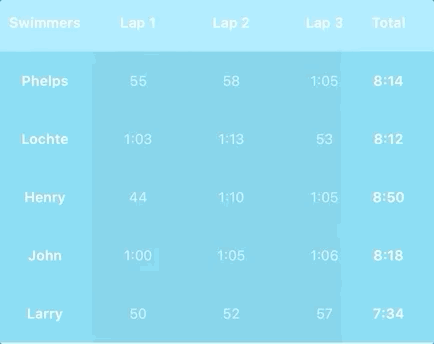

# StickyLayout 
[](https://codecov.io/gh/jeffreysfllo24/StickyLayout)
[](https://cocoapods.org/pods/StickyLayout)
[](https://cocoadocs.org/pods/StickyLayout)


# New 2023 Update  
- [X] Added Fixed Footers option
- [X] Fixed footer will stick to the bottom of the screen, even when there are not enough sections to fill the screen.

## Dynamically Set `fixedFooter` Property

To dynamically set the `fixedFooter` property in your app, you can modify the property value based on some condition or user interaction. Below is an example of how you might toggle the `fixedFooter` property:

```
// Assume you have a reference to your custom layout
let customLayout = DSCStickyLayout(stickyConfig: yourStickyConfig)

// Dynamically set `fixedFooter` based on some condition or user interaction
customLayout.fixedFooter = shouldUseFixedFooter // Replace `shouldUseFixedFooter` with your actual condition

// Assign the custom layout to your collection view
yourCollectionView.collectionViewLayout = customLayout

// Call reloadData on your collection view to apply the changes
yourCollectionView.reloadData()
```

Example:
 <p float="right">
    
  </p>

  ## Usage:
 
<p>
  <p float="left">
    
    
  </p>

  <p float="right">
    
  </p>
</p>

##### The above examples are accessible in the `example` folder.

## What is StickyLayout?
**StickyLayout** is a collection view layout that provides sticky row and column configurability.

## Features

- [X] Configurable Sticky options.
- [X] Pure Swift 5.
- [X] Horizontal and vertical scrolling support.
- [X] Row spacing and column spacing support.
- [X] Works with every `UICollectionView`.

## Setup
Using **StickyLayout** quick and simple. First import `StickyLayout`.

```swift
import StickyLayout
```

You then have the option of creating an instance of `StickyConfig`, where you can specify which rows/columns you want to be sticky.

```swift
let stickyConfig = StickyLayoutConfig(stickyRowsFromTop: 1,
                                stickyRowsFromBottom: 0,
                                stickyColsFromLeft: 1,
                                stickyColsFromRight: 0)

let layout = StickyLayout(stickyConfig: stickyConfig)
```

Create an instance of `StickyLayout` with your `StickyConfig` as a parameter, and add it to your `UICollectionView`.
```swift
UICollectionView(frame: .zero, collectionViewLayout: layout)
```

## Installation
StickyLayout is available through [CocoaPods](http://cocoapods.org). To install
it, simply add the following line to your Podfile:

```ruby
pod "StickyLayout"
```

## Feedback and Suggestions
If you have any suggestions or improvements please open a pull request or create an issue.

And if you found StickyLayout useful or want to show support feel free to star this repo!
